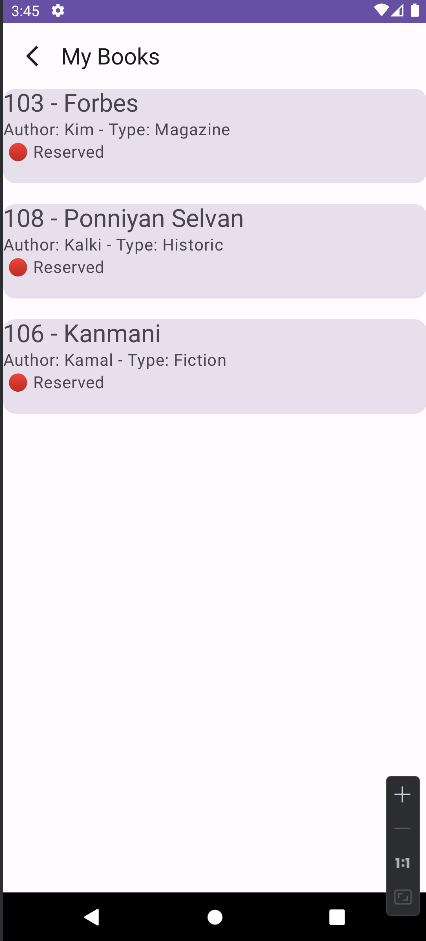

# Library Management System 📚

## Overview
The Library Management System (LMS) is a software application designed to automate library operations, including book management and user interactions. It serves both administrators and students, providing features such as browsing books, borrowing books, and managing reservations. The system is built using Kotlin programming language, Jetpack Compose for UI development, and SQLite for data storage.

## Technologies Used
- **Kotlin**: Main programming language for backend logic and business logic implementation.
- **Jetpack Compose**: Modern UI toolkit for building native Android apps with declarative UI.
- **SQLite**: Lightweight relational database management system for local data storage.

## Functionality
### For Admins
- **Administrative Access:** Log in to access administrative functionalities. 
- **Book Management:** Add, remove, and view the list of available books. 
- **Book Transactions:** Issue books to students.
### For Students
- **User Authentication:** Log in with credentials to access student functionalities.
- **Book Browsing:** View the list of available books in the library.
- **View Reserved Books:** Access and view their own reserved books.
- **Book Handling:** Return borrowed books once finished reading.

## Components
### User Interface (UI)
- Designed using Jetpack Compose, providing a modern and intuitive user experience.
- Consists of screens for admin login, admin dashboard, student login, student dashboard, book management, and borrowing.

### Backend Logic
- Implemented in Kotlin, handling business logic, data validation, and database operations.
- Manages book records, user records, borrowing, and updates availability status.

### Data Storage
- Utilizes SQLite database for storing book records, user records, borrowing history, etc.
- Tables include books, users, borrowed_books, etc.

### Database Structure
The SQLite database consists of three tables:
1. Admin: Stores information about administrators (admin_id, username, password).
2. Student: Stores information about students (student_id, username ).
3. Books: Stores information about books (book_id, title, author,type, availability).

## Dependencies
- **Jetpack Compose**: A modern UI toolkit for building native Android UIs.
  ```gradle
    implementation("androidx.lifecycle:lifecycle-runtime-ktx:2.7.0")
    implementation("androidx.lifecycle:lifecycle-runtime-ktx:2.7.0")
  ```
- **Navigation**:  Modern UI toolkit for Android navigation.
  ```gradle 
    implementation ("androidx.navigation:navigation-compose:2.4.0-alpha04")
  ```
- **SQLite**: A lightweight relational database management system.
  ```gradle 
    import android.database.sqlite.SQLiteDatabase
    import android.database.sqlite.SQLiteOpenHelper
  ```
-  **Coroutines**: Kotlin's native support for asynchronous programming.
  ```gradle 
    implementation("org.jetbrains.kotlinx:kotlinx-coroutines-core:1.8.0")
    implementation ("org.jetbrains.kotlinx:kotlinx-coroutines-android:1.7.3")
  ```


  
  
## Welcome Page
- The welcome screen serves as the initial interface for accessing the Library Management System (LMS) application. It offers convenient access for both administrators and students through separate login portals. 
    
    


## Admin Page
1. **View All Books**:
    - Allows administrators to view a list of all available books in the library.
    - Displays book details such as title, author, category, and availability status.

2. **Issue Book to Student**:
   - Allows administrators to issue books to students for borrowing.
   - Requires input of student ID and book ID, and updates book availability status accordingly.

3. **Add Book**:
    - Enables administrators to add new books to the library inventory.
    - Requires input of book details such as title, author, and category.

3. **Remove Books**:
    - Provides functionality to remove existing books from the library inventory.
    - Administrators can select books to be removed based on book ID.
      
      
      

## Student Page
1. **View Books**:
    - Allows students to browse the list of available books in the library.
    - Displays book details and availability status.

2. **Student Reserved Books**:
    - Provides students with a view of books they have reserved for borrowing.
    - Displays reserved book details and status.

3. **Return Book**:
    - Allows students to return borrowed books to the library.
    - Requires input of book ID and updates book availability status accordingly.

      
      
## Conclusion
The Library Management System (LMS) simplifies library operations, enhances user experience, and improves efficiency for administrators and students alike. Leveraging Kotlin, Jetpack Compose, and SQLite, the system offers a modern and robust solution for managing library resources effectively.

